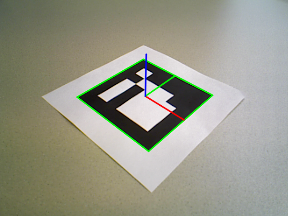
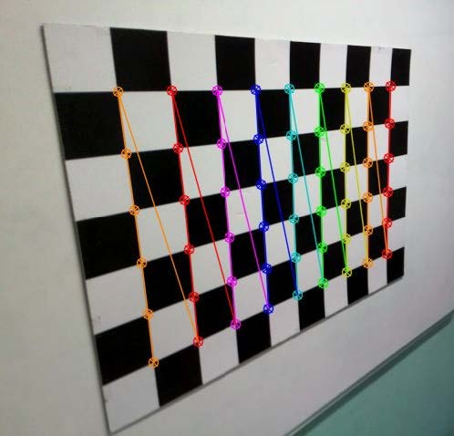
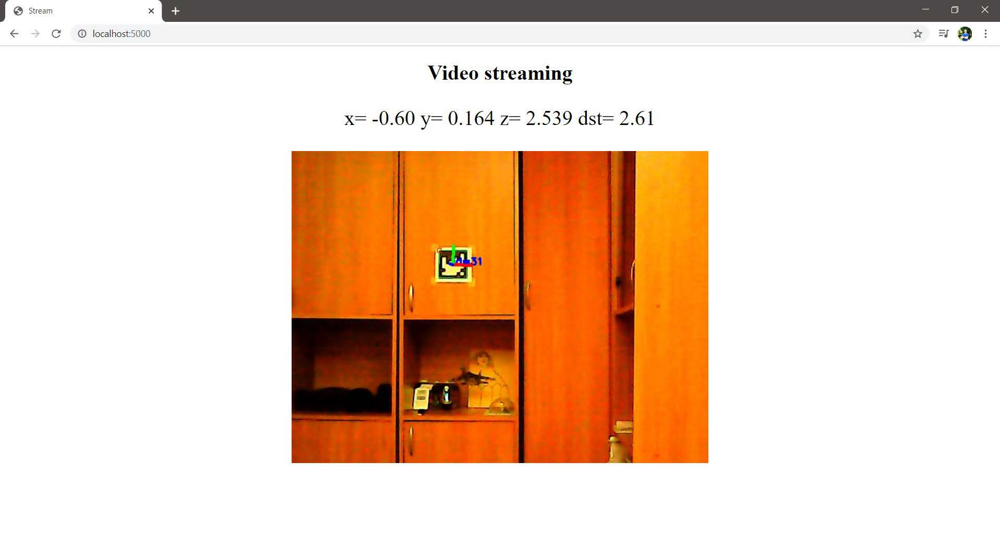

## Распознавание маркеров ArUco и трансляция на сервер
**Проект был выполнен в качестве курсовой работы на втором курсе физического факультета МГУ**

**Полное описание проекта в pdf-файле**

Пример распознавания маркера:

Калибровка камеры:

Трансляция видеопотока на сервер и определение координат камеры:

Код состоит из нескольких основных файлов:

+ webserver.py -- http сервер на локальной машине на 5000 порте. Транслирует видео с камеры и произвольную текстовую информацию. Так же записывает видео в файлы.
+ videorecorder.py -- записывает видео с камеры в avi файлы с использованием кодеков MPEG
+ aruco_detecter.py -- находит, выделяет границы, и подписывает id aruco-меток в видеопотоке с камеры.
+ aruco_generator.py -- генерирует aruco-метки с заданным ID в .png изображения

И нескольких вспомогательных папок:

+ static/js -- js модуль для урощенной трансляции текстовой информации
+ templates/index -- html страница с трансляцией
+ videos -- в папку помещаются все сгенерированные видео
